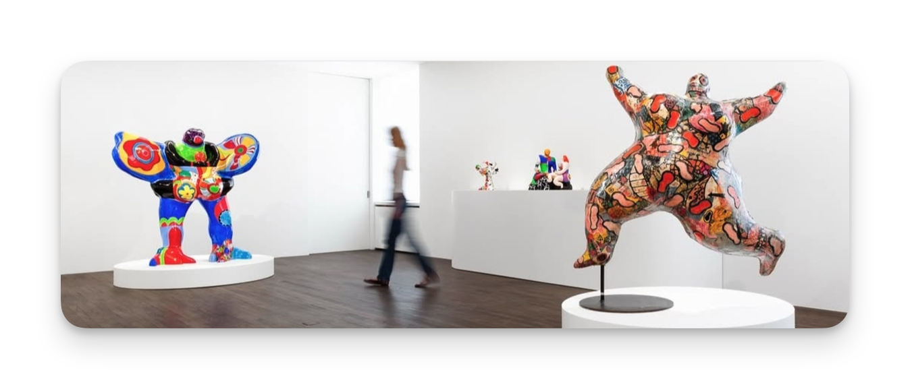

# ExpoApp

Une application de recherche, découverte et de partage des expositions autour de chez soi.

## Modélisation UML

- Diagrammes de cas d'utilisation
- [Diagrammes de classes](classes.md)
- [Diagrammes de séquences](sequences.md)

### Diagrammes de cas d'utilisation (Use Case)

Les Use Case permettent de définir l'ensemble des cas d'utilisation d'une application. On peut assimiler cela à des fonctionnalités.

En partant de notre application d'entraînement, nos use cases se concentrent sur 2 usages :

- Utilisateur (Internaute)
  - Rechercher des expositions
  - Commenter une exposition
  - Partager une exposition
- Admin (Administrateur)
  - Gestion des expositions (CRUD)
  - Modération des commentaires

### Diagrammes de classes

Les classes représentent les entités de notre application. Ce sont les données qui nous seront utiles pour réalisé les use cases. On organise le tout en Orienté Objet afin de profiter des avantage de la POO.

Malgré qu'on pense à faire 2 classes pour nos usages (Utilisateur et Admin), on peut en faire une seule car elles sont toutes des utilisateurs de l'application. Représentés par une class `User`, on distinguera les utilisateurs par leur rôle (avec une propriété) dans l'application.

Cette étape est importante, car elle sera le résultat du schéma de notre base de données et des contrôleurs de notre application avec une approche `MVC`.

### Diagrammes de séquences

Les algorithmes sont indispensable pour passer à l'implémentation de code dans notre application. Une autre façon de bien déterminer l'execution des processus est de faire des diagrammes de séquences.

Les séquences représentent les interactions entre les objets de notre application et les données qui doivent être manipulées. C'est un excellent moyen de détecter les problématiques en amont et de valider le tout avant de commencer à implémenter.

## Note de fin de cours

Au delà d'être imposé dans le cadre du DWWM, ce triptique est un atout indispensable à tout dev souhaitant penser, conceptualiser et réussir le développement d'une application web. **80% de préparation et 20% de réalisation**, est un bon moyen de comprendre l'importance de la modélisation et autres activités liées à la conception d'application web.
---

## Les outils

- **Draw.io** pour les use cases
- **Mermaid** pour les diagrammes de classes et de séquences

*Privilégez les outils le moins graphique possible pour vous concentrer sur la conception de vos diagrammes.*