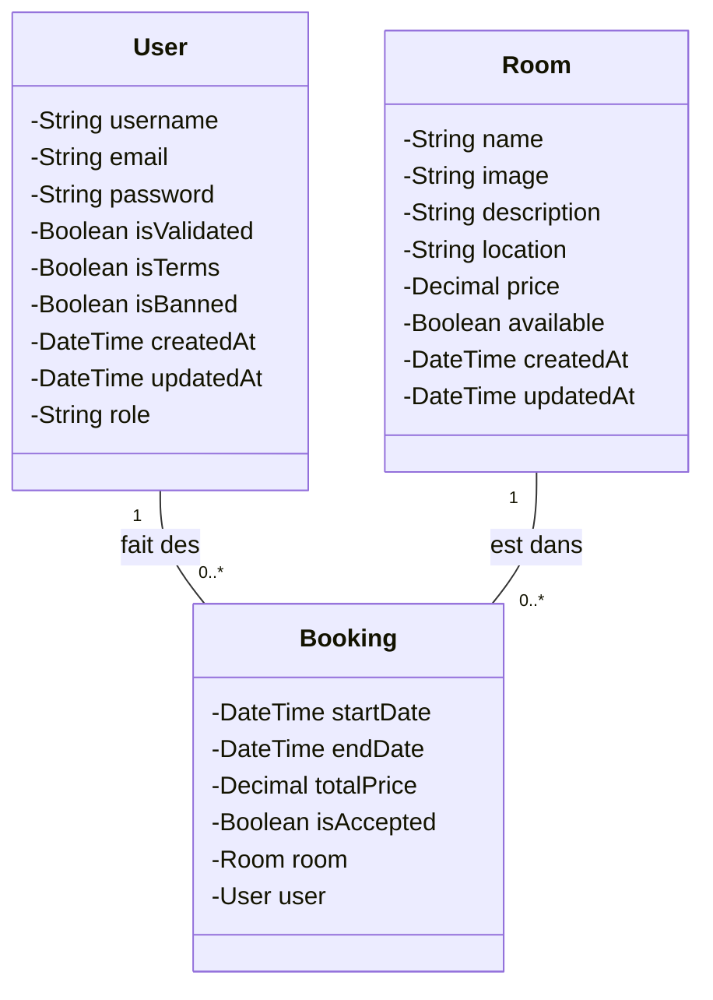

# Correction

Une plateforme de réservation de salles permet aux utilisateurs inscrits de rechercher une salle, consulter sa disponibilité, réserver une plage horaire, et recevoir un email de confirmation. L'administrateur peut valider ou refuser les réservations.

