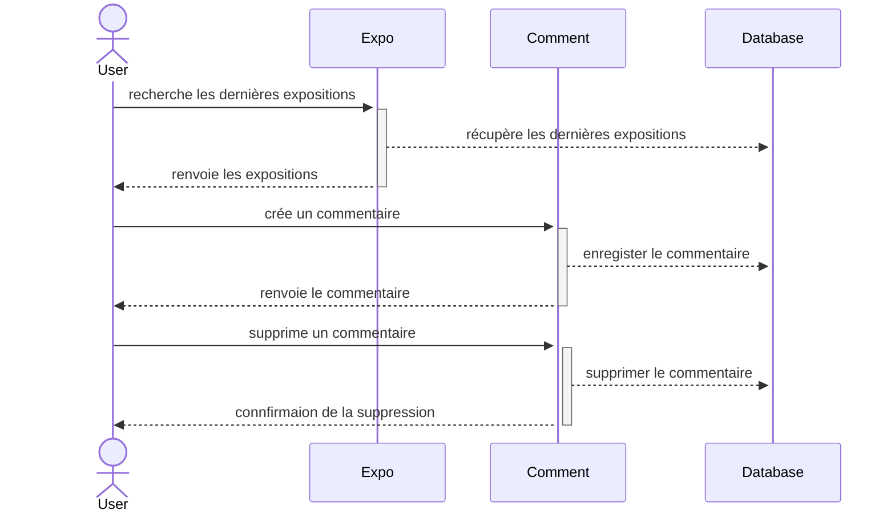

# Diagrammes de séquneces

Représentation des séquences de l'application ExpoApp.

```mermaid

sequenceDiagram
    actor User
    participant Expo
    participant Comment
    participant Database

    User->>+Expo: recherche les dernières expositions
    activate Expo
    Expo-->>+Database: récupère les dernières expositions
    Expo-->>-User: renvoie les expositions
    User->>+Comment: crée un commentaire
    activate Comment
    Comment-->>+Database: enregister le commentaire
    Comment-->>-User: renvoie le commentaire
    User->>+Comment: supprime un commentaire
    activate Comment
    Comment-->>+Database: supprimer le commentaire
    Comment-->>-User: connfirmaion de la suppression

```