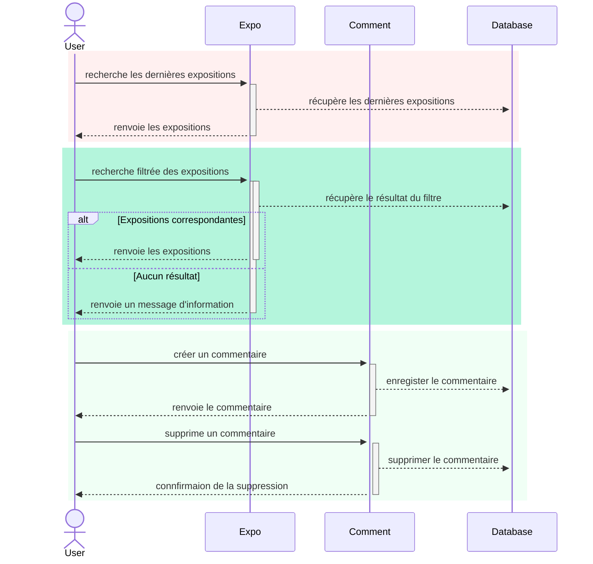
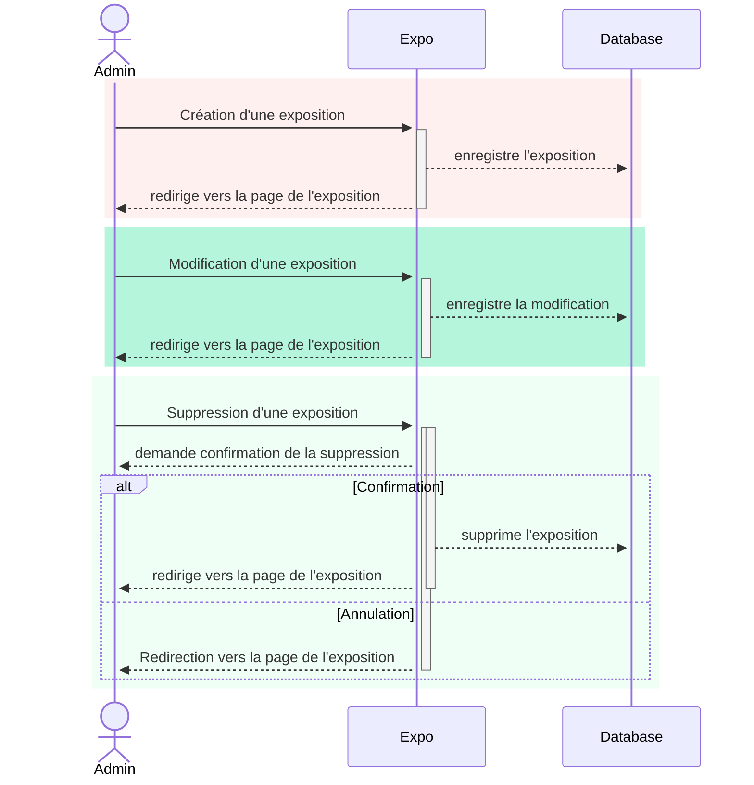

# Diagrammes de séquneces

Représentation des séquences de l'application ExpoApp.

## Les actions des utilisateurs

```mermaid

sequenceDiagram
    actor User
    participant Expo
    participant Comment
    participant Database

    rect rgb(255,240,240) 
        User->>+Expo: recherche les dernières expositions
        activate Expo
        Expo-->>+Database: récupère les dernières expositions
        Expo-->>-User: renvoie les expositions
    end

    rect rgb(180,245,220) 
        User->>+Expo: recherche filtrée des expositions
        activate Expo
        Expo-->>+Database: récupère le résultat du filtre
        alt Expositions correspondantes
            Expo-->>-User: renvoie les expositions
        else Aucun résultat
            Expo-->>-User: renvoie un message d'information
        end
    end

    rect rgb(240,255,245) 
        User->>+Comment: créer un commentaire
        activate Comment
        Comment-->>+Database: enregister le commentaire
        Comment-->>-User: renvoie le commentaire
        User->>+Comment: supprime un commentaire
        activate Comment
        Comment-->>+Database: supprimer le commentaire
        Comment-->>-User: connfirmaion de la suppression
    end

```

## Les actions de l'admin

```mermaid

sequenceDiagram
    actor Admin
    participant Expo
    participant Database

    rect rgb(255,240,240) 
        Admin->>+Expo: Création d'une exposition
        activate Expo
        Expo-->>+Database: enregistre l'exposition
        Expo-->>-Admin: redirige vers la page de l'exposition
    end

    rect rgb(180,245,220) 
        Admin->>+Expo: Modification d'une exposition
        activate Expo
        Expo-->>+Database: enregistre la modification
        Expo-->>-Admin: redirige vers la page de l'exposition
    end

    rect rgb(240,255,245) 
        Admin->>+Expo: Suppression d'une exposition
        activate Expo
        Expo-->>+Admin: demande confirmation de la suppression
        alt Confirmation
            Expo-->>+Database: supprime l'exposition
            Expo-->>-Admin: redirige vers la page de l'exposition
        else Annulation
            Expo-->>-Admin: Redirection vers la page de l'exposition
        end
    end

```